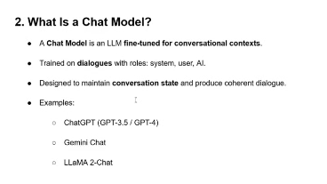
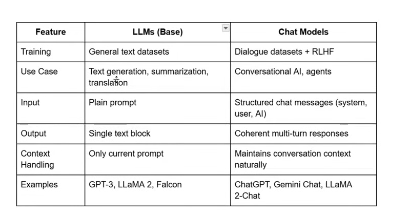
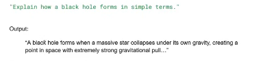

# رحلة تعلم LangChain 🚀

مستودع خاص لتوثيق رحلتي في تعلم مكتبة LangChain وبناء تطبيقات الذكاء الاصطناعي.

## 📌 الأهداف:
- [ ] فهم أساسيات LangChain و LLMs.
- [ ] تعلم كيفية التعامل مع Prompt Templates.
- [ ] تطبيق أنظمة RAG (Retrieval-Augmented Generation).
- [ ] بناء وكلاء (Agents) ذكية.

## 📂 هيكل المستودع:
- `Bsicllm/`: يحتوي على الكود البرمجي للمشاريع والدروس التجريبية.
- `requirments.txt`: قائمة المكتبات المستخدمة.

## 🛠 كيف تشغل الكود؟
1. قم بإنشاء بيئة افتراضية:
   `python3 -m venv myvenv`
   `source myvenv/bin/activate`
2. تثبيت المكتبات:
   `pip install -r requirments.txt`
3. قم بإنشاء ملف `.env` محلي وأضف مفاتيحك فيه:
   `GOOGLE_API_KEY=your_key_here`

---
## 🛠 definitions 

what is llms ? 
the large language model is a model trained on massive txt datasets to predict the next token in squence 
it can generate text answer questions summarize tranlslate etc 
example : 
Gpt-3
LLamA2
falcon 
mistral 

## connect to  gemini and groq using api key and lang chain 

## what are tokens ?
- [] tokens are units of text processed by LLms 
## A token can be 
- [] A word ("hello Word")
- [] A subword ("un","able")

- [] A punctions market (",",";")

## Examples 
 text "hello world ! "
 Tokens ---> hello , world ,!

 ## tokens are not the same are charachters one token can be muliple characters , depending on the tokenizer 

## What is a Context Window ?
* the context window is the maximum number of tokens a model can see at once 
* Determne how much text the model can consider when generating responses 

* if input + output exceeds the window the model cannot access older tokens

* Example 
 * Gpt-4 has context windows of 8k , 32k token depending on the version 

 * a 32k token window can roughly handle 20-25k words 

## why tokens matter 
* LLms process input in tokens 
* maximum tokens = models context window size 
* cost and response length are measured in  tokens 
* longer inputs --> more tokens --> higher computation cost 

## practical impleications 
* keep prompts concise for efficiency 
 # يجب ان تكون البرومبت دقيقة من اجل كفاءة افضل 
* large documents -> consider spiltting into chuncks for processing

* LLms cannot remmember past the context window without memory augmentayion 

* usefull for applicatons like RAG (Retrival augmented Gerneration) where you feed relevant chuncks only 

*

 -->

## Example : Using LLM VS ChatModel 
* example 1 Base LLM 
   prompt: 
*تم التوثيق بواسطة: [ali salhab]*

* example 2 chatModel

